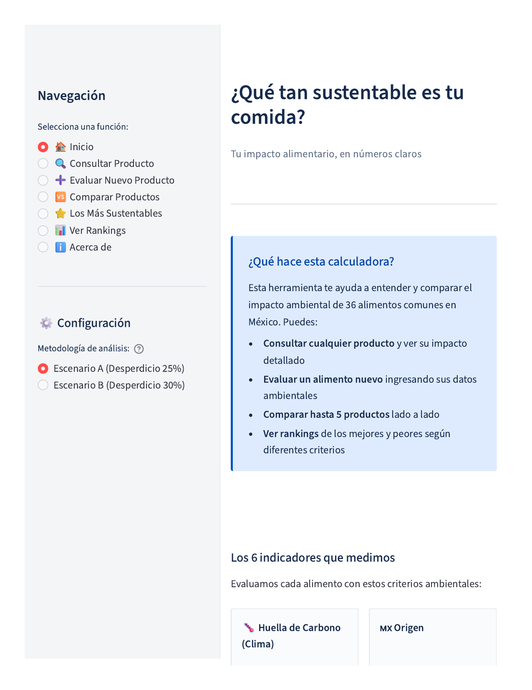
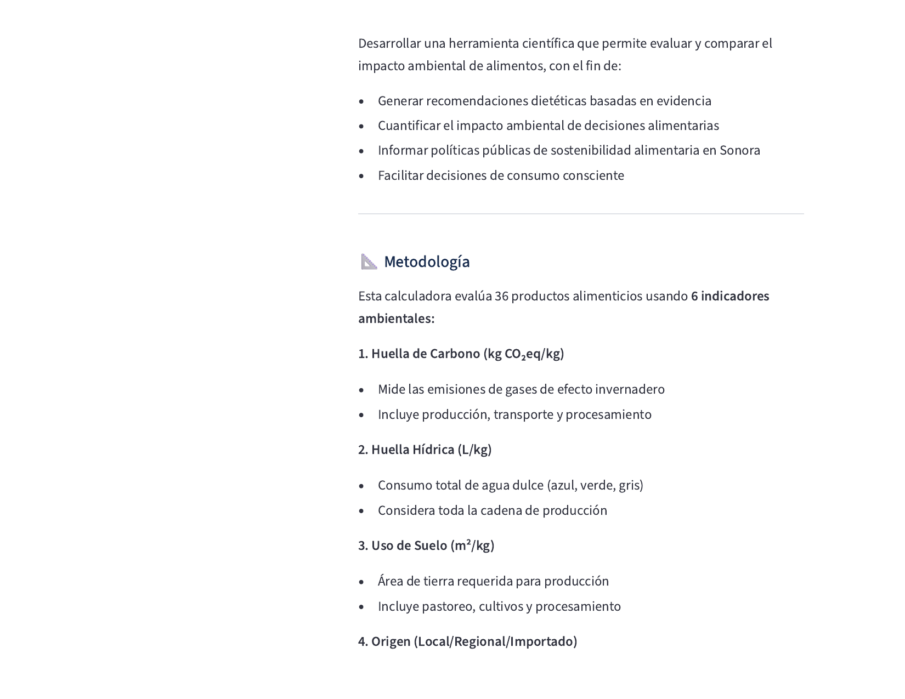
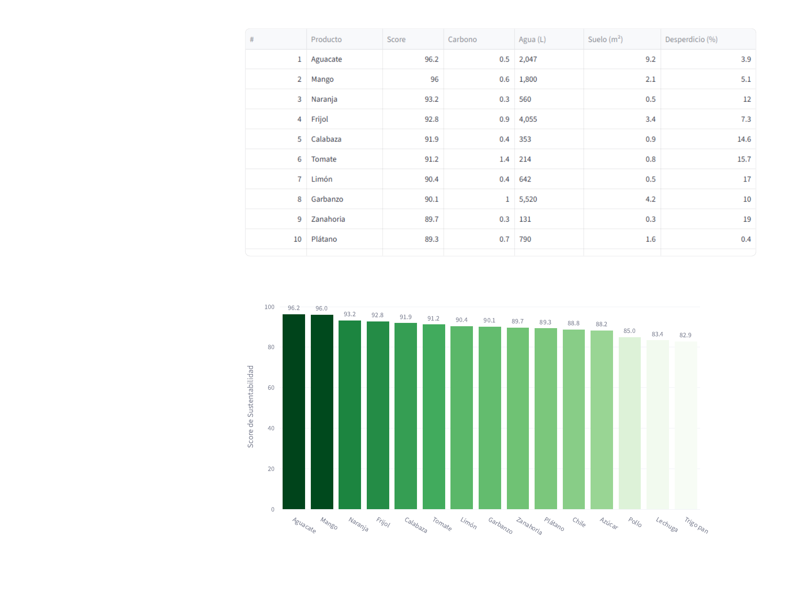
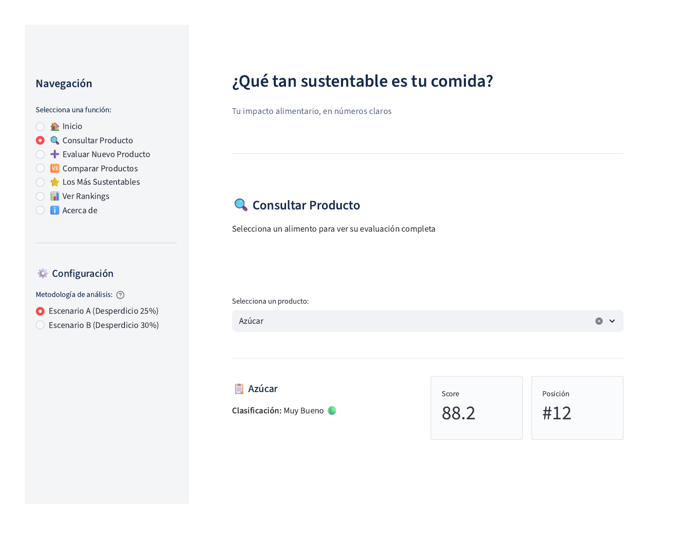

# 🌱 Ecuación de Sustentabilidad Alimentaria para México

> **Modelo multi-criterio basado en datos para evaluar la sustentabilidad ambiental de alimentos en el contexto mexicano**

[](https://calculadora-sostenibilidad-y3lzywreofv7qpkpitl4tq.streamlit.app/)
[](https://www.python.org/downloads/)

**[🚀 Ver App en Vivo](https://calculadora-sostenibilidad-y3lzywreofv7qpkpitl4tq.streamlit.app/)** | **[📊 Ver Análisis](#metodología-detallada)**

---

## 📌 Resumen Ejecutivo

Este proyecto desarrolla un sistema de evaluación cuantitativa de sustentabilidad alimentaria específicamente adaptado al contexto mexicano. A través de análisis estadístico riguroso de 36 productos alimenticios usando 8 indicadores ambientales, el modelo identifica patrones de consumo sustentable y cuantifica su impacto potencial.

**Impacto potencial identificado:** Siguiendo las recomendaciones del modelo, los consumidores podrían reducir:
- 🌍 **95% de huella de carbono**
- 💧 **75% de consumo de agua**  
- 🏞️ **95% de uso de suelo**

---

## 🎯 El Problema

La mayoría de herramientas de evaluación de sustentabilidad alimentaria:
- Dependen de datos europeos que no reflejan la realidad mexicana
- No consideran factores locales como origen de productos o desperdicio alimentario
- Carecen de validación estadística robusta de sus metodologías

**Pregunta de investigación:** ¿Cómo crear un modelo de evaluación de sustentabilidad alimentaria contextualizado para México que sea científicamente robusto y prácticamente útil?

---

## 💡 La Solución: Enfoque Multi-Criterio Basado en Datos

### Aplicación Web Interactiva

<div align="center">

<p><em>Interfaz principal mostrando los 6 indicadores ambientales evaluados</em></p>
</div>

### Arquitectura del Modelo

El proyecto implementa un sistema de scoring ponderado que integra:

**8 Indicadores Ambientales:**
1. **Huella de Carbono** (kg CO₂eq/kg)
2. **Huella Hídrica** (L/kg)
3. **Uso de Suelo** (m²/kg)
4. **Score de Origen** (local vs importado)
5. **Porcentaje de Desperdicio** (datos FAO México)
6. **Clasificación NOVA** (nivel de procesamiento)

### Metodología de Análisis

```python
# Normalización inversa (valores menores = mejor score)
score_normalizado = 100 - ((valor - min) / (max - min)) * 100

# Agregación ponderada por escenario
Score_Final = Σ(indicador_normalizado × peso)
```

**Validación estadística:**
- ✅ Análisis de correlación entre indicadores
- ✅ Análisis de sensibilidad (4 escenarios de ponderación)
- ✅ Identificación de productos "ultra-robustos" (consistentes en todos los escenarios)
- ✅ Bootstrapping para intervalos de confianza

---

## 🔍 Hallazgos Clave

### 9 Productos "Ultra-Robustos"
Productos que aparecen en el top 10 de **ambos** escenarios de ponderación (r=0.9915):

<div align="center">

<p><em>Productos más sustentables identificados por el modelo</em></p>
</div>

| Producto | Score Promedio | Categoría |
|----------|----------------|-----------|
| Aguacate | 94.2 | Excelente ⭐ |
| Mango | 91.8 | Excelente ⭐ |
| Frijol | 89.5 | Muy Bueno |
| Naranja | 88.7 | Muy Bueno |
| Plátano | 87.3 | Muy Bueno |
| Calabaza | 86.9 | Muy Bueno |
| Tomate | 85.4 | Muy Bueno |
| Garbanzo | 84.8 | Muy Bueno |
| Limón | 83.6 | Muy Bueno |

### Rankings Completos

<div align="center">

<p><em>Visualización del ranking completo con métricas detalladas</em></p>
</div>

### Insights del Análisis Estadístico

1. **Alta correlación Carbono-Suelo** (r=0.89): Productos con alta huella de carbono también requieren más tierra
2. **NOVA como dimensión independiente**: El nivel de procesamiento no correlaciona con impacto ambiental directo
3. **Consistencia metodológica**: 90% de overlap en top 10 entre escenarios A y B

---

## 🛠️ Tech Stack & Skills Demostradas

### Lenguajes & Frameworks


- **Python 3.11** - Lenguaje principal
- **Streamlit** - Desarrollo de aplicación web interactiva
- **Pandas & NumPy** - Manipulación y análisis de datos
- **Matplotlib & Plotly** - Visualización de datos

### Análisis Estadístico
- Análisis de correlación (Pearson)
- Normalización de datos (min-max scaling)
- Análisis de sensibilidad multi-escenario
- Bootstrap para intervalos de confianza
- Validación cruzada de metodología

### Ingeniería de Datos
- Integración de 5 fuentes de datos heterogéneas
- Limpieza y validación de datos
- Diseño de esquema de scoring robusto
- Manejo de datos faltantes

### Desarrollo de Software
- Testing automatizado (pytest - 68 test cases)
- Documentación técnica
- Control de versiones (Git)
- Deployment en producción (Streamlit Cloud)

---

## 📊 Estructura del Proyecto

```
calculadora-sostenibilidad/
│
├── README.md                               # Este archivo
├── app_calculadora_sostenibilidad_v2.py    # Aplicación principal Streamlit
├── requirements.txt                         # Dependencias del proyecto
├── .gitignore                              # Archivos excluidos de Git
│
├── data/                                   
│   ├── dataset_con_scores_A_y_B.csv        # Dataset con scores calculados
│   └── productos_robustos_consenso.csv     # Top productos validados
│
├── images/                                 # Screenshots de la aplicación
│   ├── 01_home.png
│   ├── 02_rankings.png
│   ├── 03_top_productos.png
│   └── 04_consultar_producto.png
│
├── tests/
│   ├── test_app_calculadora_sostenibilidad_v2.py  # 68 unit tests
│   └── pytest.ini                          # Configuración pytest
│
└── docs/
    └── TEST_README.md                      # Documentación de testing
```

---

## 🚀 Cómo Usar

### Opción 1: Usar la App en Línea (Recomendado)
👉 **[Ir a la Calculadora](https://calculadora-sostenibilidad-y3lzywreofv7qpkpitl4tq.streamlit.app/)**

<div align="center">

<p><em>Análisis detallado por producto con radar chart de indicadores</em></p>
</div>

### Opción 2: Ejecutar Localmente

1. **Clonar el repositorio**
```bash
git clone https://github.com/laura8am/calculadora-sostenibilidad.git
cd calculadora-sostenibilidad
```

2. **Instalar dependencias**
```bash
pip install -r requirements.txt
```

3. **Ejecutar la aplicación**
```bash
streamlit run app_calculadora_sostenibilidad_v2.py
```

4. **Ejecutar tests**
```bash
pytest -v
```

---

## 📖 Metodología Detallada

### Fuentes de Datos

| Fuente | Indicador | Validación |
|--------|-----------|------------|
| SU-EATABLE LIFE Database | Huella de Carbono, Hídrica, Suelo | Dataset europeo peer-reviewed |
| López-Olmedo et al. (2022) | Clasificación NOVA | Publicación científica mexicana |
| FAO México | Porcentaje de Desperdicio | Datos oficiales regionales |
| PROFECO | Accesibilidad Económica | Precios mercado mexicano |
| ENSANUT | Densidad Nutricional | Encuesta nacional de salud |

### Escenarios de Ponderación

**Escenario A (Balance):**
- Carbono: 20% | Agua: 15% | Suelo: 15%
- Origen: 10% | Desperdicio: 25% | NOVA: 15%

**Escenario B (Énfasis Desperdicio):**
- Carbono: 20% | Agua: 15% | Suelo: 10%
- Origen: 10% | Desperdicio: 30% | NOVA: 15%

### Sistema de Clasificación

El modelo clasifica productos en 5 categorías basadas en su score final:

| Categoría | Rango | Emoji |
|-----------|-------|-------|
| Excelente | ≥ 90 | 🟢 |
| Muy Bueno | 80-89 | 🟢 |
| Bueno | 70-79 | 🟡 |
| Moderado | 60-69 | 🟠 |
| Bajo | < 60 | 🔴 |

---

## 📈 Roadmap Futuro

- [ ] Expansión a 50+ productos
- [ ] Integración de API para actualización automática de precios
- [ ] Análisis de estacionalidad
- [ ] Comparación con dietas tipo (mediterránea, occidental, tradicional mexicana)
- [ ] Módulo de recomendaciones personalizadas
- [ ] Componente SQL para queries complejas
- [ ] Visualizaciones interactivas mejoradas
- [ ] Dashboard para análisis temporal

---

## 👩‍🔬 Sobre el Proyecto

**Desarrollado por:** Laura Ochoa | Biotecnóloga  
**LinkedIn:** [linkedin.com/in/laura-ochoa](https://www.linkedin.com/in/lauraochoam/)  
**GitHub:** [@laura8am](https://github.com/laura8am)

**Objetivo:** Portfolio project para transición a roles de Data Analysis en sustentabilidad ambiental y sistemas alimentarios.

### Contexto Académico
Este proyecto surge de la necesidad de herramientas de evaluación de sustentabilidad alimentaria contextualizadas para Latinoamérica, donde la mayoría de bases de datos y calculadoras disponibles se basan en contextos europeos o norteamericanos que no reflejan las realidades de producción, distribución y consumo locales.

---

## 🙏 Agradecimientos

- FAO por datos abiertos de desperdicio alimentario
- SU-EATABLE LIFE por base de datos de huella ambiental
- López-Olmedo et al. por investigación en contexto mexicano

---

## 📬 Contacto

¿Preguntas sobre la metodología? ¿Interesado en colaborar?  
Contáctame en [LinkedIn](https://www.linkedin.com/in/laura-ochoa)

---

**⭐ Si este proyecto te parece útil, considera darle una estrella en GitHub**
